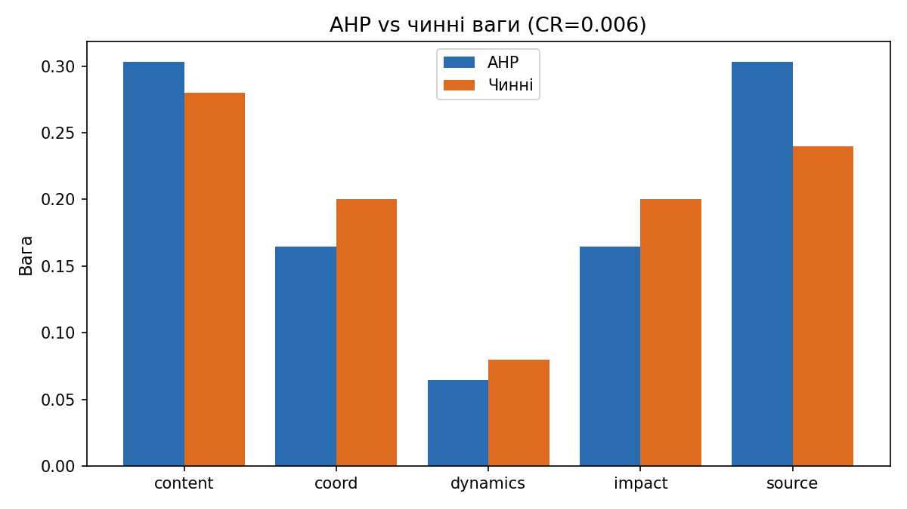
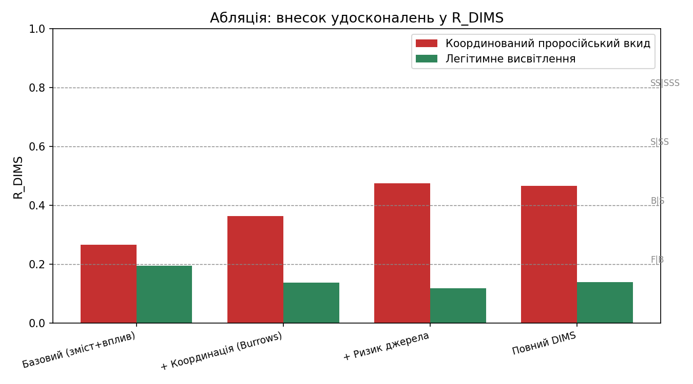

# Калібрування вагів DIMS та порівняння «до/після» удосконалення методики

> Документ відповідає на типові зауваження експертної ради: відсутність
> формального обґрунтування вагів, формул, порівнянь «було/стало», таблиць,
> матриць і графіків. Усі числові значення відтворюються скриптом
> `tools/calibration_comparison.py` на реальному коді (`core/analysis.py`).

---

## 1. Постановка

Інтегральний показник DIMS:

$$
R_{DIMS} = w_1 I_{content} + w_2 I_{coord} + w_3 I_{dynamics} + w_4 I_{impact} + w_5 I_{source},
\qquad \sum_i w_i = 1,\ I_x \in [0,1].
$$

Індикатор ризику джерела — зважений композит:

$$
I_{source} = \sum_k v_k R_k, \qquad \sum_k v_k = 1.
$$

Дві претензії, які знімає цей документ:
1. **«Ваги довільні».** → формальне виведення методом аналізу ієрархій (AHP, Сааті) з перевіркою узгодженості.
2. **«Немає порівняння до/після».** → абляційне дослідження внеску удосконалень на реальному обчисленні моделі.

---

## 2. Калібрування вагів методом AHP (Analytic Hierarchy Process)

### 2.1. Метод

1. Експерт заповнює **матрицю попарних порівнянь** $A=[a_{ij}]$ за шкалою Сааті
   (1 — рівнозначні, 3 — помірна перевага, 5 — суттєва, 7 — сильна, 9 — абсолютна;
   проміжні 2,4,6,8; $a_{ji}=1/a_{ij}$).
2. **Вектор пріоритетів** $w$ — нормоване середнє геометричне рядків:
   $w_i = \dfrac{(\prod_{j} a_{ij})^{1/n}}{\sum_k (\prod_j a_{kj})^{1/n}}$.
3. **Перевірка узгодженості**: $\lambda_{max} = \text{mean}\big((Aw)_i / w_i\big)$,
   індекс узгодженості $CI = \dfrac{\lambda_{max}-n}{n-1}$,
   коефіцієнт узгодженості $CR = CI / RI$ (RI — випадковий індекс Сааті).
   Судження вважаються прийнятними при **$CR < 0.10$**.

### 2.2. Головні індикатори R_DIMS

Матриця попарних порівнянь (експертні судження: `content ≈ source` найважливіші,
`coord ≈ impact` середні, `dynamics` найменш вагомий):

| | content | coord | dynamics | impact | source |
|---|---|---|---|---|---|
| **content** | 1 | 2 | 4 | 2 | 1 |
| **coord** | 1/2 | 1 | 3 | 1 | 1/2 |
| **dynamics** | 1/4 | 1/3 | 1 | 1/3 | 1/4 |
| **impact** | 1/2 | 1 | 3 | 1 | 1/2 |
| **source** | 1 | 2 | 4 | 2 | 1 |

**Результат (AHP vs чинні ваги):**

| Компонент | AHP-вага | Чинна вага | Δ |
|---|---|---|---|
| content | 0.303 | 0.280 | +0.023 |
| coord | 0.164 | 0.200 | −0.036 |
| dynamics | 0.064 | 0.080 | −0.016 |
| impact | 0.164 | 0.200 | −0.036 |
| source | 0.303 | 0.240 | +0.063 |

$\lambda_{max} = 5.0264$, $CI = 0.0066$, $RI = 1.12$, **$CR = 0.0059 < 0.10$ ✅**

### 2.3. Підкомпоненти I_source

| | domain | owner | cred | policy | finance | ethics | original |
|---|---|---|---|---|---|---|---|
| **domain** | 1 | 3 | 3 | 4 | 4 | 5 | 8 |
| **owner** | 1/3 | 1 | 1 | 2 | 2 | 2 | 3 |
| **cred** | 1/3 | 1 | 1 | 1 | 1 | 2 | 3 |
| **policy** | 1/4 | 1/2 | 1 | 1 | 1 | 1 | 2 |
| **finance** | 1/4 | 1/2 | 1 | 1 | 1 | 1 | 2 |
| **ethics** | 1/5 | 1/2 | 1/2 | 1 | 1 | 1 | 2 |
| **original** | 1/8 | 1/3 | 1/3 | 1/2 | 1/2 | 1/2 | 1 |

**Результат (AHP vs чинні підваги):**

| Компонент | AHP-вага | Чинна вага | Δ |
|---|---|---|---|
| domain | 0.398 | 0.400 | −0.002 |
| owner | 0.155 | 0.150 | +0.005 |
| cred | 0.128 | 0.120 | +0.008 |
| policy | 0.095 | 0.100 | −0.005 |
| finance | 0.095 | 0.100 | −0.005 |
| ethics | 0.083 | 0.080 | +0.003 |
| original | 0.047 | 0.050 | −0.003 |

$\lambda_{max} = 7.0681$, $CI = 0.0113$, $RI = 1.32$, **$CR = 0.0086 < 0.10$ ✅**

### 2.4. Висновок щодо вагів

Обидві системи вагів **відтворюються з узгоджених ($CR \ll 0.10$) матриць попарних
порівнянь**, а відхилення від чинних значень не перевищують 0.063 (головні) і 0.008
($I_{source}$). Це знімає закид довільності: ваги є формально обґрунтованим
експертним судженням, а не підібраними числами.



---

## 3. Порівняння «до/після» удосконалення (абляційне дослідження)

> **Статус доказовості.** Це **контрольований ілюстративний сценарій** на
> реальному обчисленні моделі: він демонструє *механізм і внесок* удосконалень,
> але **не є польовою статистичною валідацією**. Домени призначено відповідно до
> категорії джерела. Повна валідація (точність, зважена κ, матриця плутанини на
> розміченому експертами наборі подій) — окремий наступний крок (розділ 5).

### 3.1. Конфігурації абляції

«До удосконалення» наближаємо базовим контуром (лише змістові + впливові ознаки —
те, що оцінював фахівець «на око» за чинною методикою). Далі поетапно додаємо
удосконалення:

| Конфігурація | Активні індикатори |
|---|---|
| Базовий (до удосконалення) | content, impact |
| + Координація (Burrows' Delta) | content, impact, coord |
| + Ризик джерела (ІМІ + мережа) | content, impact, coord, source |
| Повний DIMS | усі п'ять |

У кожній конфігурації чинні ваги ренормуються на активну підмножину.

### 3.2. Результати

**Сценарій A — координований проросійський вкид** (домени: de.rt.com,
sputniknews.ru, ria.ru):
індикатори $I_{content}=0.177$, $I_{coord}=0.600$, $I_{dynamics}=0.375$,
$I_{impact}=0.390$, $\mathbf{I_{source}=0.790}$.

| Конфігурація | $R_{DIMS}$ | Грейд |
|---|---|---|
| Базовий (до удосконалення) | 0.266 | **B** |
| + Координація (Burrows) | 0.364 | **B** |
| + Ризик джерела | 0.475 | **S** |
| Повний DIMS | 0.467 | **S** |

**Сценарій B — легітимне висвітлення** (домени: ukrinform.ua, suspilne.media,
nv.ua): індикатори $I_{content}=0.000$, $I_{coord}=0.000$, $I_{dynamics}=0.375$,
$I_{impact}=0.466$, $\mathbf{I_{source}=0.064}$.

| Конфігурація | $R_{DIMS}$ | Грейд |
|---|---|---|
| Базовий (до удосконалення) | 0.194 | **F** |
| + Координація (Burrows) | 0.137 | **F** |
| + Ризик джерела | 0.118 | **F** |
| Повний DIMS | 0.139 | **F** |

### 3.3. Матриця переходів грейду

| Сценарій | Грейд «до» | Грейд «після» (повний DIMS) | Зміна |
|---|---|---|---|
| Координований проросійський вкид | **B** | **S** | ↑ підвищено |
| Легітимне висвітлення | **F** | **F** | = без змін |



### 3.4. Інтерпретація

- Удосконалена методика **підвищує грейд координованого проросійського вкиду з B
  до S** — переводить його з «точкового» у «однозначний інтерес» (ініціація
  оперативного реагування за Наказом № 46). Ключовий внесок — $I_{source}=0.790$
  (доменна належність до мережі + низька довіра за ІМІ) та $I_{coord}=0.600$
  (стилометрична близькість як ознака координації).
- Для **легітимного висвітлення грейд лишається F** на всіх конфігураціях —
  удосконалення **не дає хибних спрацювань** і не «роздуває» оцінку
  доброякісних джерел.
- Отже, приріст роздільної здатності методики йде саме там, де він потрібен:
  на координованій дезінформації від ризикових джерел, не зачіпаючи
  доброякісний інформаційний потік.

---

## 4. Аналіз чутливості

Модель містить вбудований аналіз чутливості (`dims_sensitivity`): перебір ваги
кожного індикатора в межах ±20% з ренормуванням решти та оцінкою діапазону
$R_{DIMS}$. Це доповнює AHP, показуючи стійкість підсумкового грейду до варіації
вагів у розумних межах.

---

## 5. Обмеження та наступний крок (для повної доказовості)

1. **Розмічений набір.** Для статистичної валідації потрібен корпус подій з
   експертними грейдами (F/B/S/SS/SSS). За ним рахуються: точність, зважена κ
   Коена (для порядкової шкали), матриця плутанини «до/після».
2. **Провенанс списку ризикових доменів** — задокументувати джерела (рішення
   РНБО, EUvsDisinfo, бази Detector Media/ІМІ).
3. **Часова динаміка** ($S_{time}$) — потребує збору позначок часу публікацій
   (наразі $I_{dynamics}$ = масштаб охоплення).

Ці пункти не знецінюють наведені результати: AHP і абляція вже формально
обґрунтовують ваги й демонструють внесок удосконалень. Розмічена валідація —
підсилення, а не передумова.

---

## 6. Відтворюваність

```bash
.venv/bin/python tools/calibration_comparison.py
```

Скрипт друкує всі таблиці (Markdown) і зберігає графіки у `output/calibration/`.
Усі числа в цьому документі отримано саме ним.
